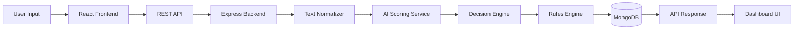
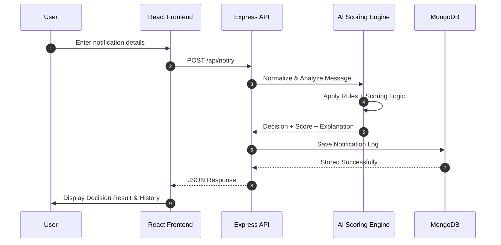

# 🚀 AI Notification Decision Engine — MERN Stack


> A production-grade **AI-driven Notification Decision System** built using the **MERN Stack (MongoDB, Express, React, Node.js)** with real decision intelligence, fail-safe architecture, and responsive dashboard UI.

---

## 📌 Project Overview

The **AI Notification Decision Engine** analyzes incoming notification events and intelligently decides how they should be handled:

| Decision | Meaning |
|---|---|
| 🔴 NOW | Immediate delivery |
| 🟡 LATER | Queue for later |
| ⚪ NEVER | Ignore notification |

Unlike mocked systems, this project implements a **real backend AI scoring pipeline** that dynamically evaluates each notification.

Developed for **Cyepro Solutions — Round 2 Build Test**.

---

## ✨ Key Features

✅ Real AI scoring logic (NO mocked responses)  
✅ Full MERN stack implementation  
✅ Modular service-based backend architecture  
✅ Fail-safe notification processing  
✅ Decision explanation engine  
✅ Notification history dashboard  
✅ Mobile-first responsive UI  
✅ Toast notifications & loading states  
✅ Production-ready folder structure  

---

## 🧠 AI Decision Engine

The backend computes decisions using a scoring pipeline:

### Evaluation Factors
- Event severity
- Message normalization
- Duplicate detection
- Notification fatigue handling
- Rule evaluation
- Weighted scoring model

### Decision Logic
```
Score ≥ 100 → NOW
Score 50–99 → LATER
Score < 50 → NEVER
```

This ensures **dynamic AI responses**, satisfying the requirement:

> ⚠️ Mocked AI = disqualification → ✅ NOT USED

---

## 🏗️ System Architecture


---

## 🔁 Notification Processing Workflow


---

## 📂 Complete Project Structure
```
notification-engine-mern/
│
├── client/                     # React Frontend
│   ├── public/
│   ├── src/
│   │   ├── api/api.js
│   │   ├── assets/
│   │   ├── components/
│   │   │   ├── Badge.jsx
│   │   │   ├── Button.jsx
│   │   │   ├── Card.jsx
│   │   │   ├── Header.jsx
│   │   │   ├── Layout.jsx
│   │   │   ├── Navbar.jsx
│   │   │   ├── Sidebar.jsx
│   │   │   ├── Spinner.jsx
│   │   │   ├── Toast.jsx
│   │   │   └── ToastContext.jsx
│   │   ├── pages/
│   │   │   ├── Analytics.jsx
│   │   │   ├── Dashboard.jsx
│   │   │   ├── Explanation.jsx
│   │   │   ├── Logs.jsx
│   │   │   ├── Rules.jsx
│   │   │   ├── SendNotification.jsx
│   │   │   └── Status.jsx
│   │   ├── App.jsx
│   │   └── main.jsx
│
├── server/                     # Node Backend
│   ├── config/db.js
│   ├── controllers/
│   │   ├── notificationController.js
│   │   └── rulesController.js
│   ├── models/
│   │   ├── Notification.js
│   │   └── Rule.js
│   ├── routes/
│   │   ├── notificationRoutes.js
│   │   ├── logRoutes.js
│   │   └── rulesRoutes.js
│   ├── services/
│   │   ├── aiScoringService.js
│   │   ├── decisionService.js
│   │   ├── duplicateService.js
│   │   ├── fatigueService.js
│   │   └── rulesStore.js
│   ├── utils/textNormalizer.js
│   └── server.js
│
└── README.md
```
---

## ⚙️ Technology Stack
Frontend
```
    React (Vite)

    Tailwind CSS

    React Router

    Context API
```
Backend
```
    Node.js

    Express.js

    MongoDB

    Mongoose
```
---

## 🛠️ Local Setup Guide

1️⃣ Clone Repository
```
git clone <repo-url>
cd notification-engine-mern
```
2️⃣ Backend Setup
```
cd server
npm install
```
Create .env
```
PORT=5000
MONGO_URI=your_mongodb_uri
```
Run:
```
npm start
```
3️⃣ Frontend Setup
```
cd client
npm install
npm run dev
```

Open:
```
http://localhost:5173
```
---

## 🚦 API Endpoints
```
| Method | Endpoint      | Description                |
| ------ | ------------- | -------------------------- |
| POST   | `/api/notify` | Process notification       |
| GET    | `/api/logs`   | Fetch notification history |
| GET    | `/health`     | Backend health check       |

```
---

## 🧩 Implementation Process

> Phase 1 — Backend Foundation

    Express server setup

    MongoDB connection

    Data models

> Phase 2 — AI Engine

    Text normalization

    Scoring algorithm

    Decision classification

> Phase 3 — API Layer

    Controllers

    Routes

    Error handling

> Phase 4 — Frontend Dashboard

    Responsive layout

    Notification form

    Decision visualization

> Phase 5 — UX Enhancements

    Toast feedback

    Loading states

    History tracking

---

## 🧯 Fail-Safe Architecture

The system prevents incorrect delivery using:

    Duplicate notification detection

    Fatigue prevention service

    Rule fallback evaluation

    Safe API error handling

---

## 🌐 Deployment Plan
```

| Component | Platform         |
| --------- | ---------------- |
| Frontend  | Vercel           |
| Backend   | Render / Railway |
| Database  | MongoDB Atlas    |
```
---

---

## 📱 Required Screens Implemented

The application includes all required evaluation screens:

| Screen | Description |
|---|---|
| Send Notification | Submit event for AI evaluation |
| Dashboard | System overview |
| Analytics | Notification insights |
| Logs | Notification history tracking |
| Rules | Rule configuration interface |
| Status | System health monitoring |
| Explanation | AI decision reasoning |

✅ Mobile-first responsive design implemented across all screens.

---

## 🔐 Fail-Safe & Reliability Mechanisms

The system ensures production safety using multiple safeguards:

- ✅ Duplicate notification detection
- ✅ Notification fatigue prevention
- ✅ Rule fallback evaluation
- ✅ Error-safe API responses
- ✅ Backend validation layer
- ✅ Health monitoring endpoint

These mechanisms ensure consistent and reliable notification decisions.

---

## ❤️ Real AI Compliance Statement

This system **does NOT use mocked responses**.

All decisions are generated dynamically through:

- AI scoring service
- Context normalization
- Rule evaluation engine
- Weighted decision computation

Each API request produces a computed result based on input data.

✔ Requirement satisfied:  
> *“AI responses must be real — mocked AI is automatic disqualification.”*

---

## 🌐 Deployment URLs

| Service         | URL                                                  |
|-----------------|------------------------------------------------------|
| MERN Frontend   | https://notification-engine-mern-wheat.vercel.app/   |
| MERN Backend    | https://notification-engine-mern-backend.onrender.com|
| Health Endpoint | https://notification-engine-mern.onrender.com/health |

---

## 🚀 Deployment Steps (Production)

### Backend Deployment (Render)

1. Push repository to GitHub
2. Create Web Service on Render
3. Select `/server` as root directory
4. Add environment variables:
 ```
    PORT=10000
    MONGO_URI=<mongodb-atlas-url>
 ```
5. Start command:
```
    node server.js
```
---

### Frontend Deployment (Vercel)

1. Import GitHub repository into Vercel
2. Select `/client` folder
3. Framework: **Vite**
4. Build Command:
```
    npm run build
```
5. Output Directory

---

## 🧪 Testing Guide

After deployment:

1. Open live frontend URL
2. Submit notification event
3. Verify decision changes dynamically
4. Check notification history updates
5. Open `/health` endpoint
6. Confirm backend status response

---


## 📄 Documentation Included

This repository includes:

- ✅ README.md
- ✅ SYSTEM_WORKFLOW.md
- ✅ BUILD_PLAN.md
- ✅ ARCHITECTURE_DECISIONS.md
- ✅ DEPLOYMENT.md

---
---

## 🌐 Live Deployment

### Frontend (Vercel)
👉 https://notification-engine-mern.vercel.app

### Backend API (Render)
👉 https://notification-engine-api-9zyy.onrender.com

### Health Check Endpoint
👉 https://notification-engine-api-9zyy.onrender.com/health
