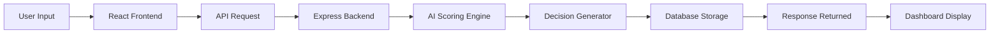

# 🔁 System Workflow — AI Notification Decision Engine

## Overview

This document explains how notifications move through the system from user input to AI-based decision output.

The workflow ensures reliable, explainable, and fail-safe notification processing.

---

## High-Level Workflow


---

## Step-by-Step Processing

Step 1 — Notification Submission

User enters:
```
    User ID

    Event Type

    Message
```

Frontend sends POST request:
```
    POST /api/notify
```
Step 2 — Backend Validation

Server validates:
```
    Required fields

    Event type correctness

    Input sanitization
```
Step 3 — Text Normalization

Message is cleaned using:
```
    lowercase conversion

    punctuation removal

    keyword extraction
```
Step 4 — AI Scoring Engine

The system evaluates:
```
    Event severity

    Context signals

    Notification fatigue

    Duplicate detection

    Rule matching
```
A weighted score is generated.

Step 5 — Decision Classification
```
| Score Range | Decision |
| ----------- | -------- |
| ≥ 100       | NOW      |
| 50–99       | LATER    |
| < 50        | NEVER    |
```

Notification stored in MongoDB for:
```
    Logs

    Analytics

    History tracking
```
Step 7 — Response Delivery

Backend returns:
```
    {
    decision,
    score,
    explanation
    }
```
Step 8 — UI Rendering

Frontend displays:
```
    Decision badge

    Explanation

    Timestamp

    Notification history

    Fail-Safe Workflow
```
If AI scoring fails:
```
    Rule engine fallback executes

    Safe default decision applied

    Error logged

    System remains operational
```
> Outcome

The workflow ensures:

    ✅ Real AI responses
    ✅ Reliable processing
    ✅ Traceable decisions
    ✅ Production-safe execution
